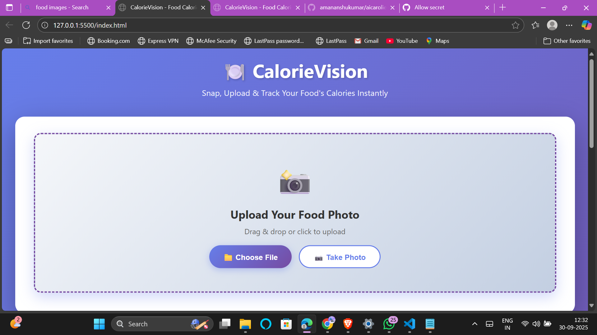
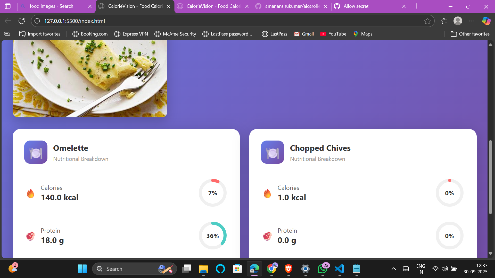

# 🍽️ CalorieVision - Food Calorie Tracker  

A beautiful, responsive web application that analyzes food images and provides detailed nutritional information using AI.  

---

## 📸 Screenshots  

### Upload Interface  

*Easy drag & drop or click to upload your food photos* 

### Results Display  
  
*Detailed nutritional breakdown with circular progress indicators*  

---

## ✨ Features  

- 📸 **Camera & Upload Support** - Take photos or upload from your device  
- 🎯 **Drag & Drop** - Easy image upload  
- 🤖 **AI-Powered Analysis** - Uses Groq's Llama 4 Vision model  
- 📊 **Beautiful UI** - Circular progress indicators and animated cards  
- 📱 **Fully Responsive** - Works on mobile, tablet, and desktop  
- ⚡ **Real-time Progress** - Visual feedback during analysis  .

---

## 🚀 Setup  

1. **Clone the repository**  
   ```bash
   git clone <your-repo-url>
   cd calorie-tracker
